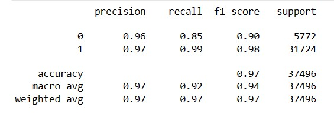
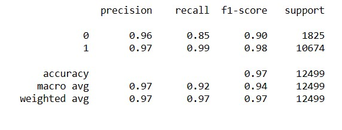
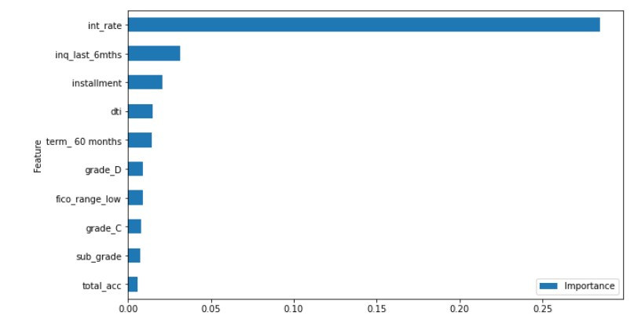
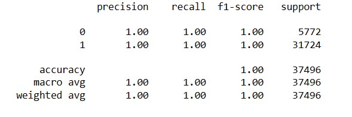
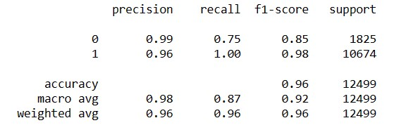
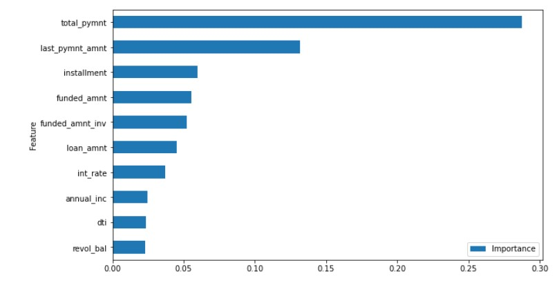
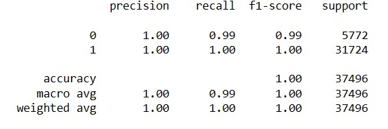
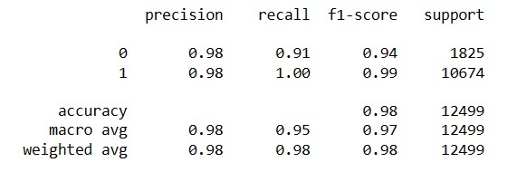
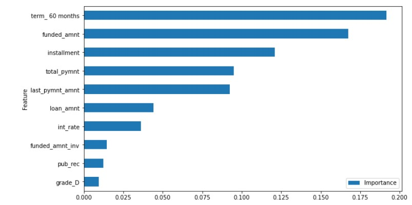

<h1 style="text-align: center;"> Lending Club Borrower Determination </h1>


#### Author: Tahron Herring

<hr>

## Overview

<p style="text-align: left;"> 
Lending Club, one of the world's largest peer-to-peer lending companies, is looking for ways to improve its loan approval process.  Specifically, the focus for this project will be to improve the borrower selection portion of the process by using machine learning models to better identify those borrowers who are more likely to repay their loans in full.
</p>

## Business Understanding

<p style="text-align: left;"> 
Determining which customers to lend financial resources to is key to the Lending Club's business. Our team has been tasked with using current data on Lending Club borrowers to accurately predict whether a new borrower will pay their loan in full.  We will also be providing a list of customer focus areas that are key to accurately predicting customer outcomes.
</p>

## Data Understanding

<p style="text-align: left;"> 
The Lending Club dataset is a large dataset with a great deal of information about borrowers and their loan statuses. The dataset contains hundreds of thousands to millions of records distributed across over 150 features.  For the purposes of this project, we will only be using roughly 50,000 records and selecting the most influential 30 or so features. After preparing our data for modeling we'll then use three different models on our dataset. The model with the best performance will be used to make recommendations to our client, the Lending Club.
</p>

## Modeling

### Logistic Regression Model


     

     

     
### Random Forest Model


     

     
 
     
### XGBoost Model


     

     
 
     
## Results & Recommendations

<p style="text-align: left;"> 
After evaluating our models and trying to improve our best performing model, we have a model with an accuracy score of around 98%.  Using this model the top five features Lending Club should be concerned with when considering if a potential borrower will repay their loan or not are the following:
</p>
  <li>Is the loan term 60 months?</li>
  <li>Consider the amount currently committed to the loan.</li>
  <li>Consider the monthly payment for the loan.</li>
  <li>Consider the payments recieved so far for the loan.</li>
  <li>Consider the last amount recieved as a payment.</li>
  
## Next Steps

<p style="text-align: left;">
This project can be improved to more accurately predict borrower behavior by incorporating some improvement techniques.  With this in mind, some potential next steps aimed at improving model performance would be the following:

 - Use more records: Only using 50,000 records from this dataset is a very small fraction of what is available and different sampling or selection techniques could be beneficial.

 - Use more features: As stated earlier, in this project we only used 30 of the over 150 features so there may be other features that contribute greatly to borrower behavior.

 - Apply different model parameters: Each model has many parameters that can be configured to try and produce better predictions.
    
 - Employ different models: Using other machine learning models may result in better results.    
</p>

## Contact Information

For additional information contact Tahron Herring at [tahron.herring@gmail.com](mailto:tahron.herring@gmail.com)

## Repository Structure

```
├── data
├── images
├──.gitignore
├── LCLP_I.ipynb
├── LCLP_II.ipynb
├── README.md
└── presentation.pdf